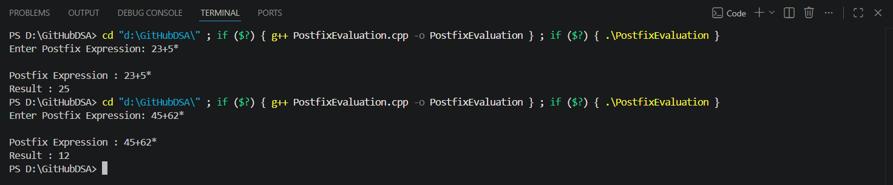

# Practical 3 – Postfix Evaluation

## 🎯 Aim

To implement the evaluation of a Postfix Expression using Stack in C++.

---

## 📖 Theory

A **postfix expression** (Reverse Polish Notation) is an expression in which the operator appears after its operands. Unlike infix expressions, postfix expressions do not require parentheses because the order of operations is determined by the position of operators.

A **stack** is used to evaluate the postfix expression. Whenever an operand is encountered, it is pushed onto the stack. When an operator is encountered, the required operands are popped from the stack, the operation is performed, and the result is pushed back onto the stack. At the end of the evaluation, the stack contains the final result.

---

## ⚙️ Operations

- Read the postfix expression.
- Push operands into the stack.
- Pop operands when an operator is encountered.
- Perform the required arithmetic operation.
- Push the result back into the stack.
- Display the final evaluated result.

---

## 📝 Algorithm

1. Start the program.
2. Read the postfix expression.
3. Create an empty stack.
4. Scan the expression from left to right.
5. If the character is an operand, push it into the stack.
6. If the character is an operator:
   - Pop the top two operands.
   - Perform the required operation.
   - Push the result back into the stack.
7. Repeat until the expression is completely scanned.
8. The top element of the stack is the final result.
9. Display the result.
10. Stop the program.

---

## ⏱️ Time Complexity

| Operation | Complexity |
|-----------|------------|
| Evaluation | O(n) |
| Push | O(1) |
| Pop | O(1) |

---

## 💻 Language

- C++

---

## 👨‍💻 Author

**Roshan Sawant**

---

## 📸 Output

